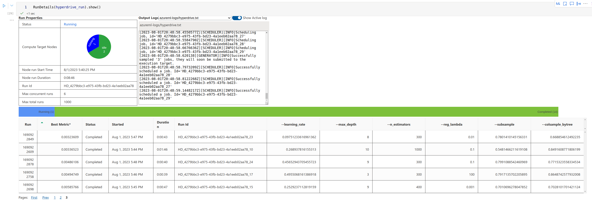
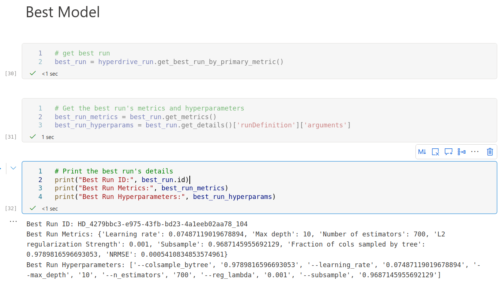
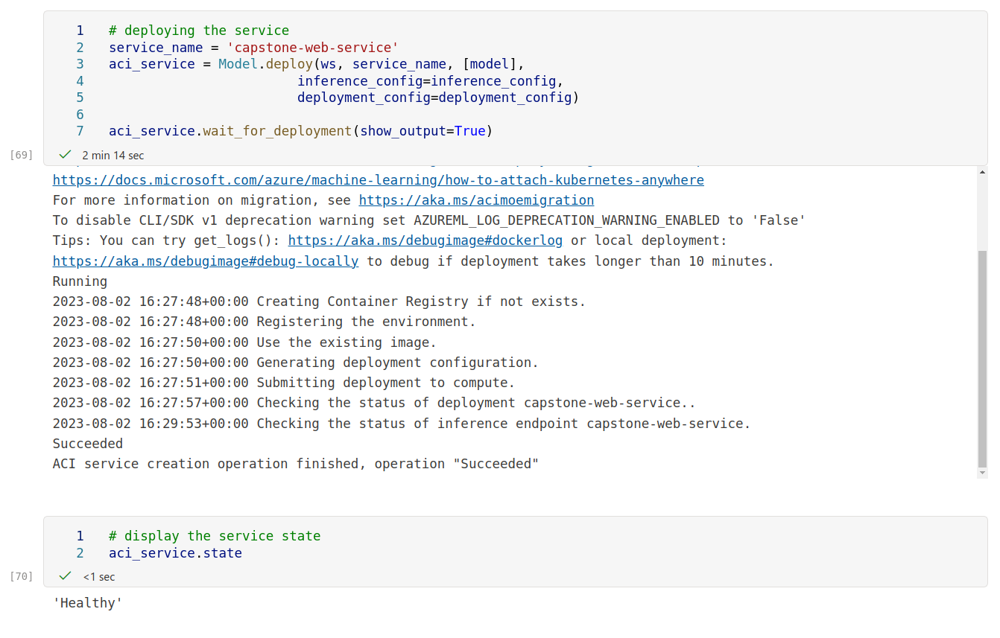

# Azure Machine Learning Engineer Nanodegree Capstone Project: Deploying the best model

In this project, I used Azure AutoML and Hyperdrive functionalities through the Python SDK to build and deploy
the best-found model for a Time Series Forecasting problem, i.e., predicting the weekly sales revenue four weeks into the future
from different Walmart retail stores. For this, I ran two different experiments: 

1. an Automated ML experiment that received the dataset as input
and tried to discover the best model to predict the sales in an automated fashion.
2. chose a model architecture and performed automated hyperparameter tunning using hyperdrive to find the model with the best metric.

Since this time series forecasting is nothing more than a special type of regression problem, the chosen primary metric to be optimized was the Normalized Root Mean Squared Error: <br>

<br>
The best model between the two experiments will be picked, registered in the workspace, and deployed as a real-time web service on an Azure Container Instance. The project workflow is as follows: <br>


## Screen Recording
To provide an even better understanding of the project I have recorded a short demo going through the key points of the projet. I hope it helps!
<screencast>
- A working model
- Demo of the deployed  model
- Demo of a sample request sent to the endpoint and its response

## Project Set Up and Installation
Most of the work was done running jupyter notebooks using the Azure Machine Learning Studio Notebooks section. You can find the notebooks in the `starter_file` folder under the name 'automl.ipynb' and 'hyperparameter_tunning.ipynb'.
The environment definition files used in the web service container instance are also available in the path: `/starter_file/env_files`

## Dataset and Task

### Overview
This dataset contains information about sales of stores from a Retail Company, namely Walmart. The dataset contains historical weekly sales revenue (which is our target column) and other
supporting variables for that period like:

1. Store identifier
2. average temperature in the week 
3. whether or not there was a holiday during the week
4. fuel price
5. Consumer Price Index(CPI)
6. Unemployment rate 

The goal of this task is to use historical data to forecast sales numbers for the next four weeks. These predictions are going to support
finance and business people in the company to manage the store's inventory. <br>
This dataset comes from Kaggle and further details about it can be found [here.](https://www.kaggle.com/datasets/asahu40/walmart-data-analysis-and-forcasting) 

#### dataset Access
I downloaded the dataset from Kaggle on my local machine, uploaded it to the notebook workspace, loaded it, and registered it using the Python SDK. I also download the dataset directly from Kaggle into memory, when I ran the train.py script during the hyperdrive trails.

## Automated ML
After registering the dataset, the first thing done was to create a compute cluster where the experiment is going to run.
After that the cluster is provisioned, I specify some automl settings:
- compute_target where the experiment is going to run. In our case, the compute cluster, we just created
- primary metric: The metric we want to optimize. Since we're dealing with a time series forecasting problem, Normalized root mean squared error is a great pick
- experiment_timeout_minutes: Maximum time that the experiment can run. I want the experiment to run for 60 minutes maximum.
- enable_early_stopping: Set it to True to allow the training iteration to prematurely end if the model scores are not improving
- n_cross_validations and cv_step_size: cross validation parameters. Set it to "auto" so automl job can investigate how to best split the data to perform cross validation
- y_min and y_max: The minimum and maximum values used to normalize RMSE. We set this values so we can have the same standard later when running the hyperdrive experiment 
- Verbosity: set logging verbosity to INFO
- Forecasting parameters: Object containing info about the forecasting job that needs to be performed. In our specifc case, it specifies what is the name of the time column, what is the forecast horizon(4 weeks) and what column(s) identify the time series
<br>
And then run the experiment:<br>


### Results
I use ```RunDetails(automl_run).show()``` to monitor the progress of the experiment.<br>


The best model is retrieved and its metrics are the following:


Using ```best_model.get_properties()``` it is possible to see that the best model was a Voting ensemble of the following models:


## Hyperparameter Tuning
For the hyperparameter tunning experiment, I chose an Xgboost Regressor model. Xgboost models gained a lot of notoriety recently for winning Kaggle Data science competitions and being able to fit highly accurate models. The hyperparameters I chose to tune were:
 - Learning_rate: This hyperparameter controls the step size at each boosting iteration. A lower learning rate makes the model converge slowly but can lead to better generalization. On the other hand, a higher learning rate can speed up the convergence but may cause the model to overfit.
 - max_depth:  It determines the maximum depth of each decision tree in the boosting process. A higher value allows the model to capture more complex relationships in the data, but it can also lead to overfitting. It's important to find the right balance for your specific problem.
 - n_estimators: This hyperparameter specifies the number of boosting rounds or decision trees to be built. Increasing the number of estimators can improve the model's performance, but it also increases the training time.
 - reg_lambda: controls L2 regularization, respectively. It adds a penalty term to the loss function, which helps in reducing overfitting and improving generalization.
 - subsample: It specifies the fraction of training samples to be used for each boosting round. Setting a value less than 1.0 introduces randomness and can help prevent overfitting. However, too low a value may lead to underfitting.
 - colsample_bytree: This hyperparameter determines the fraction of features (columns) to be randomly selected for each tree. It helps in reducing overfitting by introducing randomness in feature selection.
   
I have Chosen a RandomParameterSampling configuration to randomly try different combinations. I have also used an Early termination Policy called BanditPolicy. The Bandit Policy works by continuously monitoring the intermediate results of the ongoing training runs and comparing them to the best-performing run so far. It calculates a reward threshold based on the best-performing run and a slack factor that determines the allowed slack or deviation from the best run's performance. if a run's performance falls below the reward threshold plus the slack factor, the Bandit Policy terminates that run early.
<br>

<br>
The training code is in the train.py file. The code loads the dataset, process it(split into train and validation sets), and fits the model with the hyperparameters combination. I have chosen a simple heuristic to use the past 8 weeks as the window size, and to not shuffle data
when "train-test-splitting" to avoid data leakage.

Run details widget for monitoring job hyperdrive job progress

### Results
The best model found by the experiment achieved a normalized root mean squared error of 5.4108e-4
<br>
Best model characteristics:

## Model Deployment
comparing the best model yield by Automl and Hyperdrive jobs, We can observe the following:<br>

1. The best model from AutoML has a normalized root mean squared error of 0.05943
2. The best model from Hyperdrive has a normalized root mean squared error of 5.4108e-4

Since the fine-tuned Xgboost Regressor found by the Hyperdrive job performs the best, this is the model that will be deployed.
The steps for deploying the model were:
1. Write a score.py script that will be run in an ACI instance to perform real-time inference.
2. Get the environment where the best model was run to make sure that all code dependencies are accounted for.
3. Get the registered model from the workspace.
4. Create inference and deployment configuration for where the script is going to be run.
5. deploy the model.
<br>
Deploying the model:

